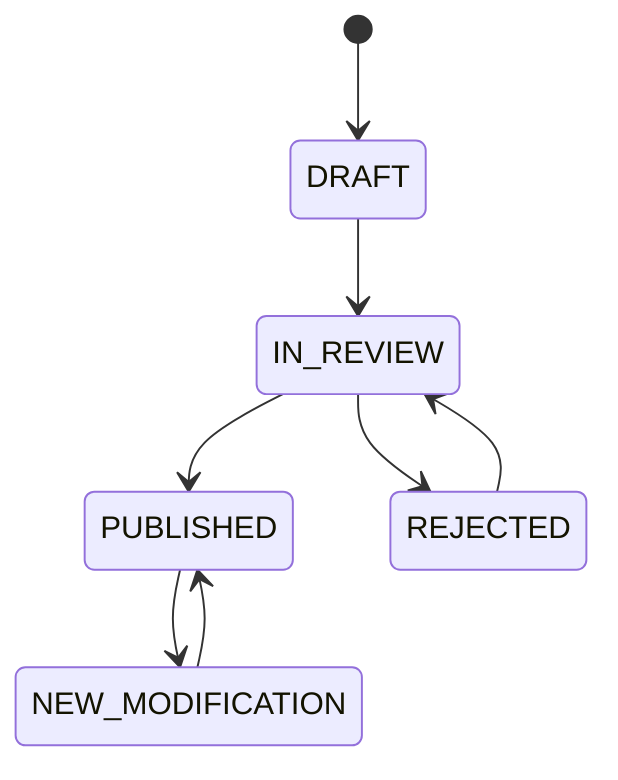

# Chalender API

# Data

## Event: State Diagram

```mermaid
stateDiagram-v2
    [*] --> DRAFT

    DRAFT --> IN_REVIEW
    IN_REVIEW --> PUBLISHED
    PUBLISHED --> NEW_MODIFICATION
    NEW_MODIFICATION --> PUBLISHED
    IN_REVIEW --> REJECTED
    REJECTED --> IN_REVIEW
```

